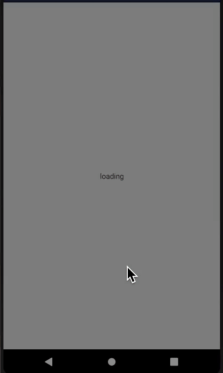

### Contents

Library provides an `AsyncImage` composable, which is structured in the following manner.

    @Composable
    fun AsyncImage
        Box(modifier = modifier.clipToBounds()) {
            Image(
                bitmap = bitmapState.value.asImageBitmap(),
                modifier = modifier.scale(scaleFactor),
                ...

Wrapping the `Box` with `clipToBounds` modifier, around the `Image` makes it possible to scale the image
contents without causing the image contents to overflow the `Box` dimensions.

### Usage

Following composable snippet shows `AsyncImage` usage. It takes the following parameters. Debugging via logs
can be enabled easily. Enable debugging to automatically show `CacheUtils` logs, application cache folder contents with `listCache`.

- urlString: String
- modifier: Modifier
- scaleFactor: Float = 1f

 

    @Composable
    fun ExampleScreen() {
    
        LaunchedEffect(true) {
            AsyncImageLoader.debug = true
        }

        AsyncImage("https://i.ytimg.com/vi/7C2z4GqqS5E/default.jpg",
            modifier = Modifier
                .width(100.dp)
                .height(70.dp), scaleFactor = 2f)

    }

#### Details

On navigating away from, say, `ExampleScreen`, and returning, the following logs are displayed if debugging is enabled.
- `writeCache` means that the image was loaded for the first time
- `listCache` is only seen in the logs when any side-effect calling `AsyncImageLoader.debug = true` gets invoked

 

    lib.asyncimage    I  CacheUtils: listCache
    lib.asyncimage    I  CacheUtils: writeCache
    lib.asyncimage    I  CacheUtils: listCache
    lib.asyncimage    I  aHR0cHM6Ly9pLnl0aW1nLmNvbS92aS83QzJ6NEdxcVM1RS9kZ
    lib.asyncimage    I  CacheUtils: readCache
    lib.asyncimage    I  CacheUtils: listCache
    lib.asyncimage    I  aHR0cHM6Ly9pLnl0aW1nLmNvbS92aS83QzJ6NEdxcVM1RS9kZ
    lib.asyncimage    I  CacheUtils: readCache

Hashed string in the log is actually the cached image filename. Such unique hashes bear one to one correspondence
with the URL itself. Following utility converts URL to filename.

        private fun networkUrlToCacheFilename(url: HttpUrl): String {
            val urlAsBytes = url.toString().encodeToByteArray()
            val encodedUrlString = Base64.getUrlEncoder().encodeToString(urlAsBytes)
            return encodedUrlString.substring(
                0, encodedUrlString.count() - base64StringSkipTrailingCount
            )
        }

### Platforms

- minSdk 29
- targetSdk 34

### Example

#### Details

This library repo is released to .
To import the full release version, add the jitpack repo to the **settings.gradle** file, and then include it as an `implementation`
in the app **build.gradle** file.

    // snippet from settings.gradle file
    dependencyResolutionManagement {
        repositoriesMode.set(RepositoriesMode.FAIL_ON_PROJECT_REPOS)
        repositories {
            google()
            mavenCentral()
            maven { url 'https://jitpack.io' }
        }
    }

    // snippet from app build.gradle file
    dependencies {
        implementation 'com.github.pattmehta:asyncimage:1.5:fullRelease@aar'
    }